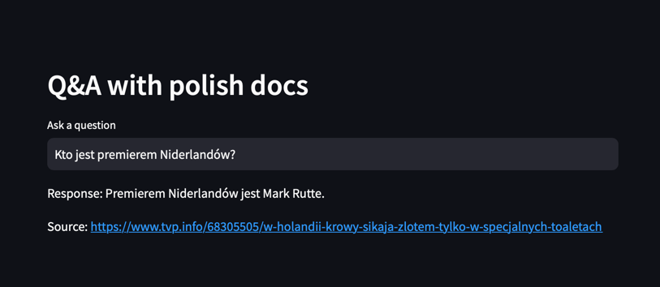

# Q&A with polish docs

This repository contains a question-answering system based on a language model GPT using a vector database for indexing.

### Prerequisites

The system has been developed using Conda environment management tool with python 3.8. The list of needed libraries is listed in `requirements.txt` file.

To use the code please create `.env` file with 
```
OPENAI_API_KEY=[YOUR_KEY]
```

### Data preparation

To start please run `prepare_data.py` script to download the dataset and prepare the vector store based on OpenAI embeddings and FAISS. There are some parameters you can tune in `config.ini` file. For now there is `data.csv` file in `data/` directory which contains 20 documents from "WiktorS/polish-news" from HuggingFace. There is also already pickled file with the vector store - `vectorstore.pkl` which could be used as it is in next steps.

### Demo app

There is demo app built in Streamlit to show how the systems works. You could type the question in the input field and the answer will be provided with link to the article.

To run it please execute: `streamlit run app.py`



### Evaluation

To evaluate the system dataset of queries and answers has been prepared - for each of 10 first articles there are 2 queries manually created as well as correct answers and links to documents which should be returned. You can check this small eval dataset here: `data_eval/evaluation_data.csv`. To run the evaluation process please use `evaluate.py` script.

### Evaluation results

Automatic evaluation stated that system returns 13 correct answers (accuracy 0.65) and 18 correct sources (accuracy 0.9). The results of evaluation are saved in `data_eval/evaluated.csv` file. 

However, when we deep dive into examples of errors we could distinguish that:
* sometimes model returns answers in English instead of Polish - and because of that there's no match between correct answer and prediction, eg. "wzrost gospodarczy o 5%" as gold answer and "The priority for China this year is economic growth of around 5%." as prediction,
* since Polish language is a morphologically rich language it is difficult to evaluate automatically tasks with NLG part, eg. with gold answer "wewnętrzna debata w ZEA o wyjściu z OPEC" and prediction as "Wall Street Journal informował o wewnętrznej debacie w ZEA o wyjściu z OPEC, co było powodem spadków na rynku ropy" - the correct answer has been found, but there is no 1-1 match because of the conjugation of words,
* humans are biased and sometimes not precise, eg. for query "Jaki portal podał informację, że zakupione przez Rosjan drony na  AliExpress będą miały ograniczone funkcjonalności?" the gold answer is "belsat.eu", however prediction as "TVP Info" could be also treated as correct since all the articles from the dataset are from TVP Info,
* there is only one case when model did not return anything, there are no cases with halucations, all answers are related to queries and the articles found to them.

